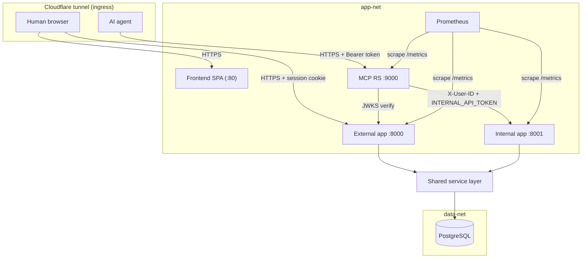

<div align="center">
<pre>
 __      ___ __ ___ _ __  
 \ \ /\ / / '__/ _ \ '_ \ 
  \ V  V /| | |  __/ | | |
   \_/\_/ |_|  \___|_| |_|
                          
-----------------------------------------------------------------------------------------
Learning-roadmap platform for humans and AI agents, built with a modular-monolith backend,
react frontend, and an MCP server for AI agents. 

</pre>


</div>

## Introduction

A multi-user learning-roadmap platform. Humans use it through a web app; AI agents use it through an MCP server. Both go through the same backend, so the rules for creating, publishing, and tracking roadmaps are defined in exactly one place.

## Technology stack

The stack is grouped by layer.

| Layer | Technologies |
|-------|--------------|
| Frontend | React 19, React Router, Vite, Tailwind CSS v4, SWR, openapi-fetch, MSW, vendored shadcn/ui primitives |
| Backend | Python, FastAPI, SQLAlchemy (async, asyncpg), Alembic, Pydantic, PyJWT (human sessions), Authlib (OAuth 2.1 AS), bcrypt, structlog, Prometheus client |
| MCP server | Python, MCP Python SDK (FastMCP, Streamable HTTP), httpx, joserfc, structlog, Prometheus client |
| Data | PostgreSQL |
| Ops | Docker Compose, Cloudflare tunnel, Prometheus, node-exporter, Alertmanager, GitHub Actions |

## Architecture

Wren is a monorepo with a Python modular-monolith backend, a separate MCP server, a React frontend, and the deployment assets. The backend is one codebase that serves two apps over a shared service layer:

- **External app (`:8000`)** is internet-facing: it authenticates humans by session cookie and hosts the public REST API and the OAuth 2.1 authorization server.
- **Internal app (`:8001`)** trusts an injected identity header and is reachable only from inside the compute network (the MCP server calls it). It is never exposed to the internet.

Both apps are assembled from one factory (`wren.core.app_factory.create_app`) and differ only by injected settings.



| Path | Protocol | Purpose |
|------|----------|---------|
| Human browser to frontend | HTTPS (`usewren.com`) | Serve the React SPA |
| SPA to external app | HTTPS + session cookie (`api.usewren.com`) | REST API and OAuth AS |
| Agent to MCP RS | HTTPS + Bearer token (`mcp.usewren.com`) | MCP tool calls; ingress exposes only PRM and `/mcp` |
| MCP RS to internal app | HTTP + `X-User-ID` + `INTERNAL_API_TOKEN` (app-net) | Forward each tool call to the service layer |
| MCP RS to external app | HTTPS (JWKS) | Verify the agent token signature |
| Prometheus to each app | HTTP `/metrics` (in-network) | Scrape metrics on `:8000`, `:8001`, `:9000` |

See `docs/architecture.md` for the component roles, trust zones, and request flows.

## Getting started

Install the prerequisites:

| Tool | Purpose | Install |
|------|---------|---------|
| uv | Python package + venv manager (backend, MCP) | https://docs.astral.sh/uv/ |
| just | Command runner for all recipes | https://github.com/casey/just |
| Node.js | Frontend toolchain (version 22) | https://nodejs.org/ |
| Docker | Postgres, the full stack, and E2E | https://docs.docker.com/get-docker/ |

Boot the backend and frontend inner loops:

```sh
just setup             # sync the Python workspace venv (all members)
just dev-infra         # start local Postgres in Docker
just dev-api           # boot the external app on http://127.0.0.1:8000
just dev-api-internal  # boot the internal app on http://127.0.0.1:8001
just setup-frontend    # install frontend dependencies
just dev-web           # boot the SPA against the real backend
```

See `docs/development.md` for the full development guide.

## Alternate run modes

| Recipe | Mode |
|--------|------|
| `just dev-mock` | SPA against the zero-backend MSW mock harness |
| `just dev-mcp` | MCP Resource Server on `:9000` (the MCP Inspector attaches here) |
| `just up-dev` | Full stack in Docker with bind mounts and reload |
| `just e2e-up` | E2E stack with published ports for Playwright |

## Common commands

| Command | Description |
|---------|-------------|
| `just setup` | Sync the Python workspace venv (all members) |
| `just dev-api` | Boot the external app on `:8000` |
| `just dev-api-internal` | Boot the internal app on `:8001` |
| `just test-backend` | Run backend tests with coverage |
| `just lint-backend` | Ruff check, format check, and mypy |
| `just migrate` | Apply migrations up to head |
| `just codegen` | Regenerate the frontend REST client from the external OpenAPI document |
| `just codegen-mcp` | Regenerate the MCP Group-A schemas from the internal OpenAPI document |
| `just up-dev` | Run the full stack in dev mode |

Run `just --list` for the full recipe set.

Health and metrics are available on all apps: `GET /healthz` (liveness), `GET /readyz` (readiness), and `GET /metrics` (Prometheus).

Configuration comes from environment variables. See `.env.example` for the canonical annotated list.

## Repository layout

The monorepo holds four concerns:

- A Python **backend** package: a shared core kit plus two apps (external and internal) over one service layer.
- A Python **MCP server** package: the agent front door that calls the backend internal app and shares no domain code with it (shared infra comes from `wren-common`).
- A React **frontend** SPA that talks to the external app over a typed REST client.
- **Ops assets**: Docker Compose files, deployment scripts, Prometheus and Alertmanager config, and the Cloudflare tunnel config.

A `contract/` project holds cross-package tests, `shared/wren-common` holds the shared backend/MCP infra, and `shared/theme/` holds the design tokens the SPA and docs site share. The Python packages form a uv workspace with a single root lockfile (`docs/packaging.md`). See `docs/architecture.md` for the conceptual model.

## Further reading

| Document | Description |
|----------|-------------|
| [docs/architecture.md](docs/architecture.md) | System topology, component roles, trust zones, and request flows |
| [docs/development.md](docs/development.md) | Prerequisites, environment setup, per-area workflows, and codegen |
| [docs/testing.md](docs/testing.md) | Test layers, commands, patterns, and high-value targets |
| [docs/ci-cd.md](docs/ci-cd.md) | CI jobs, CD phases, merge gates, and required secrets |
| [docs/api.md](docs/api.md) | REST route catalog, access rules, response contracts, and the error contract |
| [docs/data-model.md](docs/data-model.md) | Storage ownership, per-store schemas, and the roadmap lifecycle |
| [docs/auth.md](docs/auth.md) | Trust boundaries, session model, OAuth 2.1 AS, and the MCP bearer boundary |
| [docs/mcp.md](docs/mcp.md) | MCP transport, tool catalog, and the internal-hop contract |
| [docs/frontend.md](docs/frontend.md) | Frontend app plumbing, routing and guards, data layer, and views |
| [docs/authoring.md](docs/authoring.md) | Roadmap authoring model and constraints |
| [docs/progress.md](docs/progress.md) | The follow-and-study loop and the study-time read surface |
| [docs/monitoring.md](docs/monitoring.md) | Metrics, alerts, retention, and signup notifications |
| [docs/packaging.md](docs/packaging.md) | The uv workspace, single lockfile, per-member image builds, and the backend/MCP boundary |
| [docs/design-language.md](docs/design-language.md) | Visual design tokens and component conventions |
| [docs/runbooks/bring-up.md](docs/runbooks/bring-up.md) | One-time production bring-up |
| [docs/runbooks/deploy.md](docs/runbooks/deploy.md) | Repeatable deploy over the Docker Context |
| [docs/runbooks/migration.md](docs/runbooks/migration.md) | Migration strategy and commands |
| [docs/runbooks/rollback.md](docs/runbooks/rollback.md) | CI-owned rollback |
| [backend/README.md](backend/README.md) | Backend package guide |
| [mcp/README.md](mcp/README.md) | MCP server package guide |
| [frontend/README.md](frontend/README.md) | Frontend package guide |
