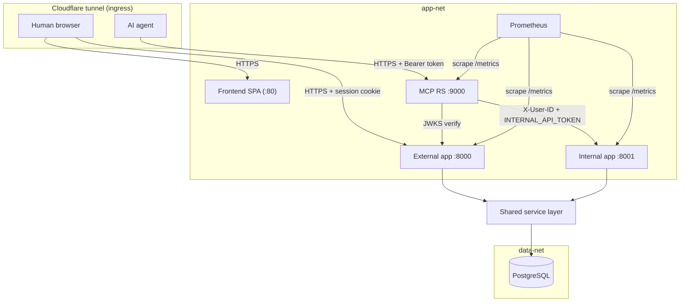
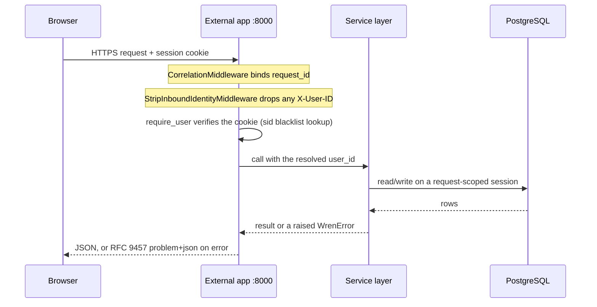
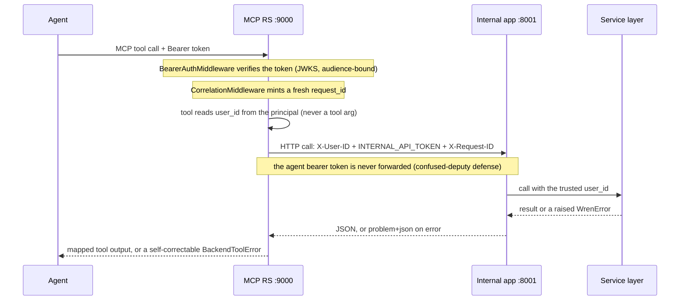

# Architecture

Wren is a learning-roadmap platform for two kinds of user. Humans use a React
SPA. AI agents use an MCP server. Both reach one backend, so the rules for
creating, publishing, and tracking roadmaps live in one place.

This guide describes the system shape, the component roles, the trust zones, and
the request flows. It documents the current implemented state and cites canonical
source paths instead of copying code.

## System shape

The system is one backend that serves two apps, one MCP Resource Server, one
React SPA, one PostgreSQL database, and one Cloudflare tunnel for ingress.

Canonical sources:

- App factory: `backend/src/wren/core/app_factory.py`
- External app entrypoint: `backend/src/wren/api/main.py`
- Internal app entrypoint: `backend/src/wren/api_internal/main.py`
- MCP RS assembly: `mcp/src/wren_mcp/app.py`
- Container topology: `docker-compose.yml`

## Topology

Two Docker bridge networks separate the tiers. `app-net` carries every
first-party service. `data-net` isolates PostgreSQL; the backend is the only
service on both. The tunnel is the only ingress and opens no inbound host port.

## Component roles

| Component | Role | Canonical source |
|-----------|------|------------------|
| External app (`:8000`) | Internet-facing. Authenticates humans by session cookie. Hosts the public REST API and the OAuth 2.1 authorization server. | `backend/src/wren/api/main.py` |
| Internal app (`:8001`) | App-net only. Trusts an injected `X-User-ID` header behind `INTERNAL_API_TOKEN`. Mounts the roadmap and progress routers over the same service layer. Never mounts the web-only lifecycle routes. | `backend/src/wren/api_internal/main.py` |
| MCP Resource Server (`:9000`) | The agent front door. An OAuth 2.1 Resource Server that verifies the agent bearer token, then forwards each tool call to the internal app. Imports no backend code. | `mcp/src/wren_mcp/app.py` |
| Frontend SPA (`:80`) | The React app for humans. Talks to the external app over a typed REST client. Served by nginx in the container. | `frontend/` |
| PostgreSQL | The single datastore. Reached by the backend over an async connection pool. | `docker-compose.yml` |
| Observability | Prometheus scrapes `/metrics` on all apps in-network. node-exporter reports host metrics. Alertmanager routes alerts to Discord. | `docs/monitoring.md` |

Both apps come from `create_app`. They differ only by injected settings and by
which routers and identity dependency they mount. Keep `app_factory.py`
wiring-only; it must not import a domain package.

## Isolation and trust zones

| Zone | Reachable from | Identity model | Must never |
|------|----------------|----------------|------------|
| External app (`:8000`) | Internet via the tunnel | Session cookie; strips any inbound `X-User-ID` app-wide | Trust a client-supplied `X-User-ID` |
| Internal app (`:8001`) | app-net only | Trusted `X-User-ID` behind `INTERNAL_API_TOKEN` | Be tunnel-routed or host-published |
| MCP RS (`:9000`) | Internet via the tunnel | Agent Bearer token, audience-bound | Forward the agent token downstream, or serve any path but PRM and `/mcp` at ingress |
| Data tier | app-net (data-net) only | Connection pool credentials | Be reachable from the edge |

Every request resolves to exactly one `user_id`. The server never trusts a
`user_id` from a request body or a tool argument. The two resolution paths live
in `backend/src/wren/core/identity.py`: `require_user` for the human cookie, and
`require_internal_user` for the trusted header behind the token.

## Design decisions

| Decision | Rationale |
|----------|-----------|
| One factory, two apps | The external and internal apps share one service layer and differ only by injected settings, so a rule is defined once. |
| No shared code between backend and MCP | The two are separate deployables. Shared wire truths are hand-duplicated and gated by `contract/tests/`, so the MCP image carries no backend dependency. |
| Fail-safe deny at every boundary | An empty `SESSION_JWT_SECRET` denies all sessions; an empty `INTERNAL_API_TOKEN` denies all internal calls; a missing state seam degrades to deny. |
| 404 over 403 | The service returns 404 for a private resource, so a caller never learns a resource exists but is off-limits. |
| Site-URL pinning | All OAuth issuer, metadata, and endpoint URLs build from pinned config, never from the request host, because the tunnel reaches the origin over an internal URL. |
| Pure-ASGI correlation middleware | `BaseHTTPMiddleware` runs the handler in a separate contextvars context, so the `request_id` binding would be invisible to the handler and the 500 log. |
| Document-plus-write-derived index | A roadmap's `document` JSONB is authoritative; scalar columns are write-derived, so reads stay cheap and the source of truth stays single. |

## Request flows

### Human authenticated request

### Agent tool call

## Background tasks

The external app runs one background task from its lifespan: a stale-client
reaper for the OAuth authorization server.

- Dynamic Client Registration is open, so registration rows would otherwise grow
  without bound.
- The reaper sweeps on a fixed interval and deletes clients whose registration is
  older than the max age, cascade-revoking each reaped client's grant and refresh
  chain.
- It is an in-process asyncio task, not a scheduled external job. The lifespan
  starts it after boot and stops it on shutdown, before the connection pool is
  disposed.
- Two environment variables tune it:
  `OAUTH_CLIENT_CLEANUP_INTERVAL_SECONDS` (default 6 hours; a non-positive value
  disables the task) and `OAUTH_STALE_CLIENT_MAX_AGE_SECONDS` (default 30 days).

Canonical source: `backend/src/wren/oauth/cleanup.py`, wired in
`backend/src/wren/api/main.py`. See `docs/development.md` for the env knobs.

## Cross-references

- Trust boundaries and the OAuth model: `docs/auth.md`.
- Storage ownership and the roadmap lifecycle: `docs/data-model.md`.
- REST route catalog and the error contract: `docs/api.md`.
- MCP transport and the internal-hop contract: `docs/mcp.md`.
- Metrics, alerts, and retention: `docs/monitoring.md`.
