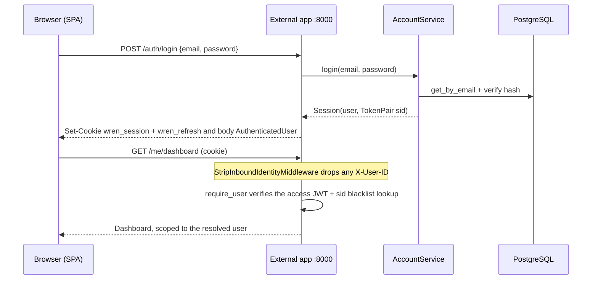
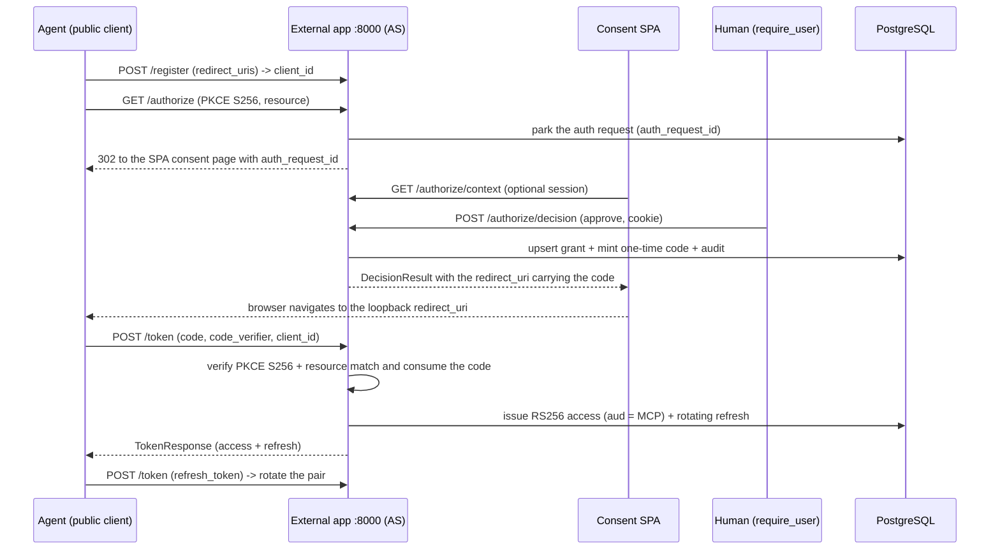

# Authentication and authorization

Wren has two kinds of caller and two matching trust boundaries. Humans reach the external app with a session cookie. AI agents reach the MCP server with an OAuth 2.1 bearer token. This guide describes both models, the OAuth authorization server, and the request flows.

This guide documents the current implemented state. It cites canonical source paths instead of copying code. For the REST route catalog and the error contract, see `api.md`.

Canonical sources:

- Identity boundaries and typed state seams: `backend/src/wren/core/`
- Human session model (codec, verifier, config): `backend/src/wren/accounts/`
- OAuth authorization server (config and URL pinning, token issuance and rotation, access-token codec, JWKS, stale-client reaper): `backend/src/wren/oauth/`

## Trust boundaries

Every request resolves to exactly one `user_id`. The server never trusts a `user_id` from a request body or a tool argument. The two resolution paths live in `core/`.

| Boundary | App | Dependency | How identity resolves | Fail-safe behavior |
|----------|-----|------------|-----------------------|--------------------|
| Human session | External `:8000` | `require_user` | Reads only the `wren_session` cookie. Verifies an HS256 JWT and runs a per-request `sid` blacklist lookup. | An unset or wrong-type verifier seam denies every session. |
| Trusted header | Internal `:8001` | `require_internal_user` | Requires a valid `X-Internal-Api-Token`, then trusts the `X-User-ID` header. | An empty token denies every call. |
| Agent bearer | MCP RS `:9000` | JWKS verify | Verifies the RS256 access token against the AS JWKS, audience-bound to the MCP resource. | A failed verify returns 401. |

Two guarantees hold at these boundaries:

- The external app wires `StripInboundIdentityMiddleware` app-wide. It removes any client-supplied `X-User-ID` before routing, so a spoofed header never reaches a handler. The internal app never wires this.
- Read the `app.state` auth seams through the typed accessors in `core/`, never by raw `getattr`. The external app sets `session_verifier`. The internal app sets `internal_api_token`. Each app sets only the seam its identity dependency reads.

The MCP bearer boundary lives in the MCP package. See `mcp.md` for the token verification, the audience binding, and the confused-deputy defense.

## Human session model

The accounts domain owns human identity. A session is two HS256 JWTs signed with `SESSION_JWT_SECRET`: a short-lived access token and a rotating refresh token.

| Property | Value | Source |
|----------|-------|--------|
| Algorithm | HS256, secret `SESSION_JWT_SECRET` | `accounts/` |
| Access token TTL | 15 minutes | `accounts/` (`DEFAULT_ACCESS_TTL`) |
| Refresh token TTL | 14 days | `accounts/` (`DEFAULT_REFRESH_TTL`) |
| Access cookie | `wren_session`, `HttpOnly`, path `/`, site-wide | `accounts/` |
| Refresh cookie | `wren_refresh`, `HttpOnly`, path `/auth` | `accounts/` (`REFRESH_COOKIE_NAME`, `AUTH_PATH`) |

Key design points:

- Both tokens share one opaque session id (`sid`). The blacklist revokes the `sid`, so revoking a session invalidates the still-unexpired access token at once, not just future refreshes.
- The verifier seam is async because verifying an access token includes the `sid` blacklist lookup, which is an I/O call.
- The refresh cookie is scoped to path `/auth`. The browser sends it only to the endpoints that rotate or revoke it. Keep refresh-touching endpoints under `/auth` or the cookie is not sent.
- `Secure` is on outside development. In production `Domain` pins the configured apex (for example `.usewren.com`) so the SPA and API subdomains share the cookie. In development `Domain` is empty and the cookie is host-only.
- Refresh rotation and logout revoke the old `sid`, so a revoked refresh cannot mint a new access token.
- The secret guard (`validate_session_secret`) fails fast outside development when the secret is under 32 bytes. In development an empty or weak secret is tolerated and every session fail-safe denies (`deny_all_sessions`).

## OAuth 2.1 authorization server

The external app hosts the OAuth 2.1 authorization server (AS) that agents use to obtain access tokens. The AS mints tokens. The MCP Resource Server verifies them.

| Aspect | Rule |
|--------|------|
| Client type | Public clients, no secret. Open Dynamic Client Registration (RFC 7591) at `/register`. |
| Client auth | `token_endpoint_auth_method=none`. Clients authenticate by PKCE. |
| PKCE | Mandatory and `S256`-only. `plain` is rejected. |
| Grant types | `authorization_code` and `refresh_token`. Response type `code` only. |
| Scopes | `roadmaps:read`, `roadmaps:write`, `progress:write`. |
| Access token | Stateless RS256 JWT, audience-bound (`aud`) to the one MCP resource (RFC 8707). Default TTL 900 seconds. |
| Refresh token | High-entropy opaque string, stored only as a SHA-256 hash. Default TTL 30 days. |
| Signing | Asymmetric. The AS holds the RSA private key. The RS verifies via the published JWKS. Rotation is by `kid`. |

Design points:

- Access tokens are stateless and cannot be revoked one by one. They are short-lived, so revocation takes effect within the access-token TTL. Rotation is enforced on every refresh exchange. The presented refresh token is revoked and a fresh pair is issued.
- Replay defense: reusing an already-rotated refresh token revokes the entire grant refresh chain (`revoke_grant_refresh_tokens`).
- Six tables back the AS. See `data-model.md` for the schema. The human HS256 session secret and the agent RSA OAuth keypair are separate secrets with separate rotation, so the two actors have separate blast radii.
- Key loading fails fast outside development when no PEM path is configured. Development generates an ephemeral in-memory 2048-bit keypair so the app boots without a mounted secret.

### Stale-client reaper

Open Dynamic Client Registration means registration rows would grow without bound. The external app runs a background reaper that keeps them bounded.

- The reaper is an in-process asyncio task, not a cron or external job. The external app lifespan starts it after boot and stops it on shutdown, before the connection pool is disposed. Canonical source: `oauth/`, wired in the external
  app (`backend/src/wren/api/`).
- The sweep reaps clients by registration age (`OAuthClient.created_at`) and cascade-revokes each reaped client's grant and refresh chain in one transaction.
- Rotation does not move `created_at`, so a client older than the max age is reaped even while it actively refreshes. That client must re-consent.
- Two environment variables tune it. `OAUTH_CLIENT_CLEANUP_INTERVAL_SECONDS` (default 6 hours; a non-positive value disables the task) sets how often the sweep runs. `OAUTH_STALE_CLIENT_MAX_AGE_SECONDS` (default 30 days) sets the registration-age threshold. The max age is an independent knob: its default matches the refresh-TTL default but is not derived from it.

## Auth flows

### Human login and authenticated request

Login returns a generic 401 on any credential mismatch, so it never reveals
whether an email is registered.

### Agent authorization and token exchange

### Refresh replay defense

A reused (already-revoked) refresh token triggers `revoke_grant_refresh_tokens(grant_id)`. That revokes the whole chain and the request returns `invalid_grant`.

## Security model

- Site-URL pinning is the highest-risk auth item. Every issuer, metadata, and endpoint URL the AS publishes is built from pinned config (`PUBLIC_BASE_URL`, `APP_PUBLIC_URL`, `MCP_PUBLIC_URL`), never from the request host. The tunnel reaches the origin over an internal URL, so a request-derived URL would break client issuer and audience validation. See `oauth/`.
- Fail-safe deny holds at every boundary. Unset or wrong-type state seams, empty secrets, and missing keys all deny or fail fast.
- The strip middleware runs on the external app only. Adding it to the internal app would break the trusted-header model. Never trust `X-User-ID` on the external app.
- The two error contracts on the OAuth router are intentional. Agent protocol endpoints raise `OAuthError` (RFC 6749 JSON). SPA-facing endpoints raise `WrenError` (problem+json). See `api.md` for the error contract.
