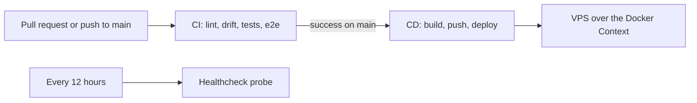

# CI/CD

This guide describes the continuous-integration jobs, the continuous-deployment phases, the merge gates, and the required secrets. It documents the current implemented state. The deploy and rollback mechanics live in the runbooks; this guide owns the pipeline view.

Canonical sources:

- CI: `.github/workflows/ci.yml`
- CD: `.github/workflows/cd.yml`
- Uptime probe: `.github/workflows/healthcheck.yml`
- Deploy script: `scripts/deploy.sh`

## Pipeline overview

CI runs on every pull request and on pushes to `main`. CD runs after CI concludes successfully on `main`, or by manual dispatch. The healthcheck workflow runs on a schedule, independent of a deploy.

## CI jobs

| Job | Gates | Notes |
|-----|-------|-------|
| `lint` | Format, style, and types for the Python workspace and the frontend | Ruff and mypy for backend, MCP, and wren-common; `tsc` and oxlint for the frontend. Gates the test jobs. |
| `codegen-drift` | The frozen frontend REST client | Regenerates the OpenAPI document and the TS client, then fails on a stale committed client. Independent of `lint`. |
| `mcp-codegen-drift` | The generated MCP Group-A schemas | Regenerates the internal-app OpenAPI artifact and the Group-A schema module, then fails on a stale committed artifact or module. Independent of `lint`. |
| `contract-drift` | Cross-package wire contracts | Runs the `contract/` project: the internal-boundary header constants, the OAuth scope constants, that the generated MCP Group-A module is exactly Group A, and that each lean write result is a field-subset of its backend source. Needs `lint`. |
| `test-backend` | Backend and MCP behavior | pytest with the 80% backend coverage gate, then the MCP suite with its 80% gate, then the wren-common seam tests. Real Postgres per test via testcontainers. Needs `lint`. |
| `test-frontend` | Frontend behavior | vitest with the 70% coverage gate. Needs `lint`. |
| `e2e` | The full spine | Builds and boots the Compose stack with the e2e overlay, runs pre-traffic migrations, then runs Playwright. Needs `lint`. |

Route coverage is not a separate job. The `test_route_registry.py` coverage check runs inside the backend pytest suite.

Every `uv` job resolves against the single root `uv.lock`: it syncs the shared workspace venv once with `uv sync --all-packages --frozen`, then runs each member's tools with `uv run --no-sync`. There are no per-package lockfiles. See `docs/packaging.md`.

## Merge gates

A change to `main` must pass every CI job. The gates that most often block a merge:

- Coverage floors: backend 80%, MCP 80%, frontend 70%.
- `codegen-drift`: the committed `frontend/openapi.json` and `frontend/src/api/schema.d.ts` must match the live external app.
- `contract-drift`: the MCP wire constants and the generated Group-A schema set must match the backend.

Run `just codegen` after any external REST change, and change both sides of a duplicated wire constant together.

## CD phases

CD deploys the whole stack to the single VPS over an SSH Docker Context. The Compose CLI runs in the runner; the engine runs on the box.

| Phase | Action |
|-------|--------|
| `discover` | Parse the deployable Compose file and emit a build matrix of the first-party images. |
| `build-and-push` | Build each first-party image and push two tags to GHCR: `:latest` and `:sha-<sha>`. |
| `deploy` | Register the Docker Context, export config and secrets CLI-side, then run `scripts/deploy.sh`. |
| Rollback (on failure) | CI-owned. Read the previous `.deployed-sha`, check it out, re-export env, and re-run the deploy pinned to the previous images and config. |

`scripts/deploy.sh` runs a fixed sequence: assert every required config and secret env var is set, pull images, run migrations pre-traffic, start the stack under the `tunnels` profile, health-gate every service for about 60 seconds, then record the deployed SHA on success. See `docs/runbooks/deploy.md` and `docs/runbooks/rollback.md` for the operator view.

The backend and MCP images build from the repo-root context (like `frontend`/`docs`), each selecting a member `dockerfile:` in `docker-compose.yml`; `discover` parses the context and dockerfile from `docker compose config`. See `docs/packaging.md` for the per-member build.

## Required secrets

CD reads these from GitHub Actions repo secrets. It exports them into the deploy step and Compose transmits them to the daemon; nothing is written to the box.

| Secret | Contents |
|--------|----------|
| `DEPLOY_SSH_KEY` | The deploy user's private SSH key |
| `DEPLOY_SERVER_IP` | The VPS public IP |
| `POSTGRES_PASSWORD` | The Postgres password |
| `SESSION_JWT_SECRET` | The HS256 human-session secret (at least 32 bytes) |
| `INTERNAL_API_TOKEN` | The shared secret for the internal boundary |
| `DISCORD_WEBHOOK_URL` | The webhook for alerts and signup notifications |
| `WREN_OAUTH_PRIVATE_KEY` | The OAuth AS signing PEM (raw) |
| `WREN_CLOUDFLARED_CREDENTIALS` | The tunnel credentials JSON (raw) |

`GITHUB_TOKEN` is the built-in Actions token; CD uses it to push images to GHCR. See `docs/runbooks/bring-up.md` for the one-time steps that produce these values.

## Healthcheck workflow

`healthcheck.yml` runs every 12 hours from GitHub's public runners. It probes three public, unauthenticated surfaces for HTTP 200:

- `https://usewren.com/` (the SPA)
- `https://api.usewren.com/.well-known/oauth-authorization-server` (AS metadata)
- `https://mcp.usewren.com/.well-known/oauth-protected-resource` (MCP PRM)

It catches failures internal scraping cannot see: DNS, the Cloudflare edge, the tunnel, and per-host ingress routing. On failure after retries it posts one Discord message and fails the job.

## Troubleshooting

| Symptom | Cause | Resolution |
|---------|-------|------------|
| `codegen-drift` fails | The committed client is stale | Run `just codegen` and commit the result |
| `mcp-codegen-drift` fails | The committed internal OpenAPI or generated Group-A module is stale | Run `just codegen-mcp` and commit the result |
| `contract-drift` fails | A wire constant or schema diverged between the backend and MCP | Change both sides together; re-run the `contract/` project |
| Deploy fails the health gate after Alertmanager starts | The Discord webhook is blank or unrendered; Alertmanager exits on config load | Provide a valid `DISCORD_WEBHOOK_URL` so CI renders the config |
| Deploy aborts before any container serves traffic | A migration failed in the pre-traffic step | Fix the migration; migrations run before traffic, so a failure aborts safely |
| Rollback refuses | No previous `.deployed-sha` exists (first deploy) | Fix forward; there is no prior release to restore |

## Cross-references

- Deploy operations: `docs/runbooks/deploy.md`.
- Rollback: `docs/runbooks/rollback.md`.
- Migration strategy: `docs/runbooks/migration.md`.
- Metrics and alert routing: `docs/monitoring.md`.
- Test layers and gates: `docs/testing.md`.
