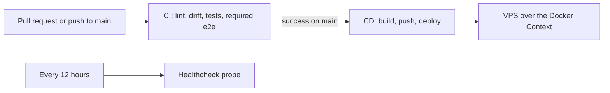

# CI/CD

This guide describes the CI gate, diagnostic policy, deployment phases, and merge gates. The deploy and rollback mechanics live in the runbooks. Canonical sources are `.github/workflows/ci.yml`, `.github/workflows/cd.yml`, `.github/workflows/healthcheck.yml`, and `scripts/deploy.sh`.

## Pipeline overview


```mermaid
graph LR
  pr["Pull request or push to main"] --> ci["CI: lint, drift, tests, required e2e"]
  ci -->|"success on main"| cd["CD: build, push, deploy"]
  cd --> vps["VPS over the Docker Context"]
  cron["Every 12 hours"] --> hc["Healthcheck probe"]
```

CI runs on every pull request and push to `main`. The `e2e` job is one stable required system-test check. CD runs after CI succeeds on `main` or through manual dispatch. The healthcheck workflow runs independently on a schedule.

## CI jobs

| Job | Gates | Notes |
|---|---|---|
| `lint` | Python and frontend format, style, and type checks | Gates the test jobs. |
| `codegen-drift` | Generated frontend REST client | Fails when committed output is stale. |
| `mcp-codegen-drift` | Generated MCP Group-A schemas | Fails when committed output is stale. |
| `contract-drift` | Cross-package headers, scopes, schemas, and lean results | Runs the `contract/` project. |
| `test-backend` | Backend, MCP, and wren-common behavior | Uses the existing coverage gates and testcontainers. |
| `test-frontend` | Frontend behavior | Uses the existing frontend coverage gate. |
| `e2e` | Complete production-mode HTTPS system suite | Uses one stack, Chromium, two workers, and the command contract below. |

Route coverage runs inside the backend pytest suite. Every uv job resolves against the shared root `uv.lock`.

## Required E2E gate

The `e2e` job runs for every pull request and push to `main`. Keep the job name stable because branch protection must require the `e2e` check. A workflow file alone does not configure branch protection.

The job installs the E2E dependencies, runs `just setup-e2e`, then runs these static gates before Compose or browser startup:

```sh
just e2e-typecheck
just e2e-lint
just test-e2e-unit
```

It then uses the same lifecycle as local runs:

```sh
just e2e-up
just test-e2e-system
just e2e-capture-artifacts   # on failure, before teardown
just e2e-down
just reset-e2e-trust
```

The system run uses one focused stack at `app.wren.test`, `api.wren.test`, and `mcp.wren.test` with ingress, frontend, one backend container, MCP, Postgres, and recorder. The backend container has separate external and internal listeners, not separate containers. It uses Chromium, two workers, `fullyParallel: false`, one CI retry, and `trace: on-first-retry`. Screenshots are captured on failure. The CI job has a 25-minute hard timeout. Static checks, setup, migration, readiness, Playwright, artifact safety, and teardown failures fail the job.

## Runtime evidence

The job records the commit SHA, GitHub run and attempt identity, complete-job duration, Playwright-step duration, worker count, retry count, browser, and shard status in the job summary. Runner queue time is excluded. Normal complete-job duration remains under 300 seconds, or five minutes, across representative completed runs.

Review sharding after any of these five conditions:

1. Complete-job p95 exceeds 240 seconds.
2. Two-worker Playwright p95 exceeds 180 seconds.
3. Worker speedup versus one worker is below 1.3x.
4. Repeatable shared-stack CPU or database contention occurs.
5. A scenario requires an environment that cannot coexist in one stack.

The initial delivery adds no GitHub Actions shards.

## Failure artifacts and cleanup

On failure, CI captures the Playwright HTML report, first-retry traces, failure screenshots, safe test attachments, logs for ingress, frontend, backend, MCP, Postgres, and recorder, and a sanitized recorder projection. The sanitizer redacts registered synthetic secrets and sensitive request fields, rebuilds the output, scans the final bytes, and fails closed. CI uploads `/tmp/wren-safe-artifacts/` only when that scan passes. A failed scan uploads no diagnostic bundle.

Capture runs before teardown while the recorder and sensitive-value registries remain available. Teardown runs after capture and upload outcomes with `if: always()`, then trust reset runs with `if: always()`. Teardown removes the disposable stack, volumes, control token, and generated OAuth signing material. Private keys, raw envelopes, cookies, tokens, passwords, request bodies, and unsafe traces are never uploaded.

## Future shard shape

When a sharding review is approved, use a two-shard matrix with `fail-fast: false`. Give each shard its own Compose project and database, one Playwright worker initially, a shard-specific run identity and artifact name, and a Playwright blob report. Merge blob reports downstream. Every shard and the merged result remain required checks. Do not choose shard count dynamically from one run's duration.

## Merge gates

A change to `main` must pass every CI job. The gates that most often block a merge:

- Coverage floors: backend 80%, MCP 80%, frontend 70%.
- `codegen-drift`: the committed `frontend/openapi.json` and `frontend/src/api/schema.d.ts` must match the live external app.
- `contract-drift`: the MCP wire constants and the generated Group-A schema set must match the backend.

Run `just codegen` after any external REST change, and change both sides of a duplicated wire constant together.

## CD phases

CD deploys the whole stack to the single VPS over an SSH Docker Context. The Compose CLI runs in the runner; the engine runs on the box.

| Phase | Action |
|-------|--------|
| `discover` | Parse the deployable Compose file and emit a build matrix of the first-party images. |
| `prepare-sentry-releases` | Verify the pinned CLI and idempotently prepare `wren-api@<sha>`, `wren-mcp@<sha>`, and `wren-web@<sha>` with their exact projects. |
| `build-and-push` | Build each first-party image, upload frontend source maps in the builder when credentials are present, and push `:latest` plus `:sha-<sha>` to GHCR. |
| `deploy` | Register the Docker Context, export config and secrets CLI-side, then run `scripts/deploy.sh`. |
| `finalize-sentry-releases` | Finalize all three releases after a healthy deploy. This bookkeeping job cannot trigger application rollback. |
| Rollback (on failure) | CI-owned. Read the previous `.deployed-sha`, check it out, re-export env, and re-run the deploy pinned to the previous images and config. |

`scripts/deploy.sh` runs a fixed sequence: assert every required config and secret env var is set, pull images, run migrations pre-traffic, start the stack under the `tunnels` profile, health-gate every service for about 60 seconds, sync host-side ops scripts to `/opt/wren/scripts/`, then record the deployed SHA on success. See `docs/runbooks/deploy.md` and `docs/runbooks/rollback.md` for the operator view.

Two SSH write paths remain (beyond the Docker Context's SSH transport): `.deployed-sha` (rollback key) and `scripts/` (ops scripts).

The backend and MCP images build from the repo-root context (like `frontend`/`docs`), each selecting a member `dockerfile:` in `docker-compose.yml`; `discover` parses the context and dockerfile from `docker compose config`. See `docs/packaging.md` for the per-member build.

## Deploy failure phases

The deploy step writes a runner-local JSON result with a closed phase and rollback flag. The workflow validates the result and enables one rollback attempt only for `startup` and `health_gate`.

| Phase | Automatic rollback | Operator action |
|---|---:|---|
| `preflight` | No | Supply required values and rerun. |
| `pull` | No | Fix registry or network access and rerun. |
| `migration` | No | Inspect database and migration state before changing images. |
| `startup` | Yes | CD restores the previous SHA, config, and image tags. |
| `health_gate` | Yes | CD restores the previous SHA, config, and image tags. |
| `post_health` | No | Repair bookkeeping or ops-script sync while healthy containers remain in place. |
| missing, malformed, or unknown | No | Treat the result as failed closed and investigate. |

Sentry release finalization runs only after the deploy job succeeds. A finalization failure does not make a healthy application rollback-eligible. A previous revision without the new phase contract is accepted during the one rollback attempt and cannot start a nested rollback.

## Required secrets

CD reads these from GitHub Actions repo secrets. It exports them into the deploy step and Compose transmits them to the daemon; nothing is written to the box.

| Secret | Contents |
|--------|----------|
| `DEPLOY_SSH_KEY` | The deploy user's private SSH key |
| `DEPLOY_SERVER_IP` | The VPS public IP |
| `POSTGRES_PASSWORD` | The Postgres password |
| `SESSION_JWT_SECRET` | The HS256 human-session secret (at least 32 bytes) |
| `INTERNAL_API_TOKEN` | The shared secret for the internal boundary |
| `DISCORD_WEBHOOK_URL` | The webhook for alerts and signup notifications |
| `WREN_OAUTH_PRIVATE_KEY` | The OAuth AS signing PEM (raw) |
| `WREN_CLOUDFLARED_CREDENTIALS` | The tunnel credentials JSON (raw) |
| `SENTRY_AUTH_TOKEN` | Organization CI token for release and source-map operations |
| `SENTRY_DSN_BACKEND` | Private backend DSN |
| `SENTRY_DSN_MCP` | Private MCP DSN |

`GITHUB_TOKEN` is the built-in Actions token; CD uses it to push images to GHCR. The public frontend DSN comes from `.env.prod` and is not a secret. See `docs/runbooks/bring-up.md` for the one-time steps that produce these values.

## Healthcheck workflow

`healthcheck.yml` runs every 12 hours from GitHub's public runners. It probes three public, unauthenticated surfaces for HTTP 200:

- `https://usewren.com/` (the SPA)
- `https://api.usewren.com/.well-known/oauth-authorization-server` (AS metadata)
- `https://mcp.usewren.com/.well-known/oauth-protected-resource` (MCP PRM)

It catches failures internal scraping cannot see: DNS, the Cloudflare edge, the tunnel, and per-host ingress routing. On failure after retries it posts one Discord message and fails the job.

## Troubleshooting

| Symptom | Cause | Resolution |
|---------|-------|------------|
| `codegen-drift` fails | The committed client is stale | Run `just codegen` and commit the result |
| `mcp-codegen-drift` fails | The committed internal OpenAPI or generated Group-A module is stale | Run `just codegen-mcp` and commit the result |
| `contract-drift` fails | A wire constant or schema diverged between the backend and MCP | Change both sides together; re-run the `contract/` project |
| Deploy fails the health gate after Alertmanager starts | The Discord webhook is blank or unrendered; Alertmanager exits on config load | Provide a valid `DISCORD_WEBHOOK_URL` so CI renders the config |
| Deploy aborts before any container serves traffic | A migration failed in the pre-traffic step | Fix the migration; migrations run before traffic, so a failure aborts safely |
| Rollback refuses | No previous `.deployed-sha` exists (first deploy) | Fix forward; there is no prior release to restore |

## Cross-references

- Deploy operations: `docs/runbooks/deploy.md`.
- Rollback: `docs/runbooks/rollback.md`.
- Migration strategy: `docs/runbooks/migration.md`.
- Metrics and alert routing: `docs/monitoring.md`.
- Test layers and gates: `docs/testing.md`.
