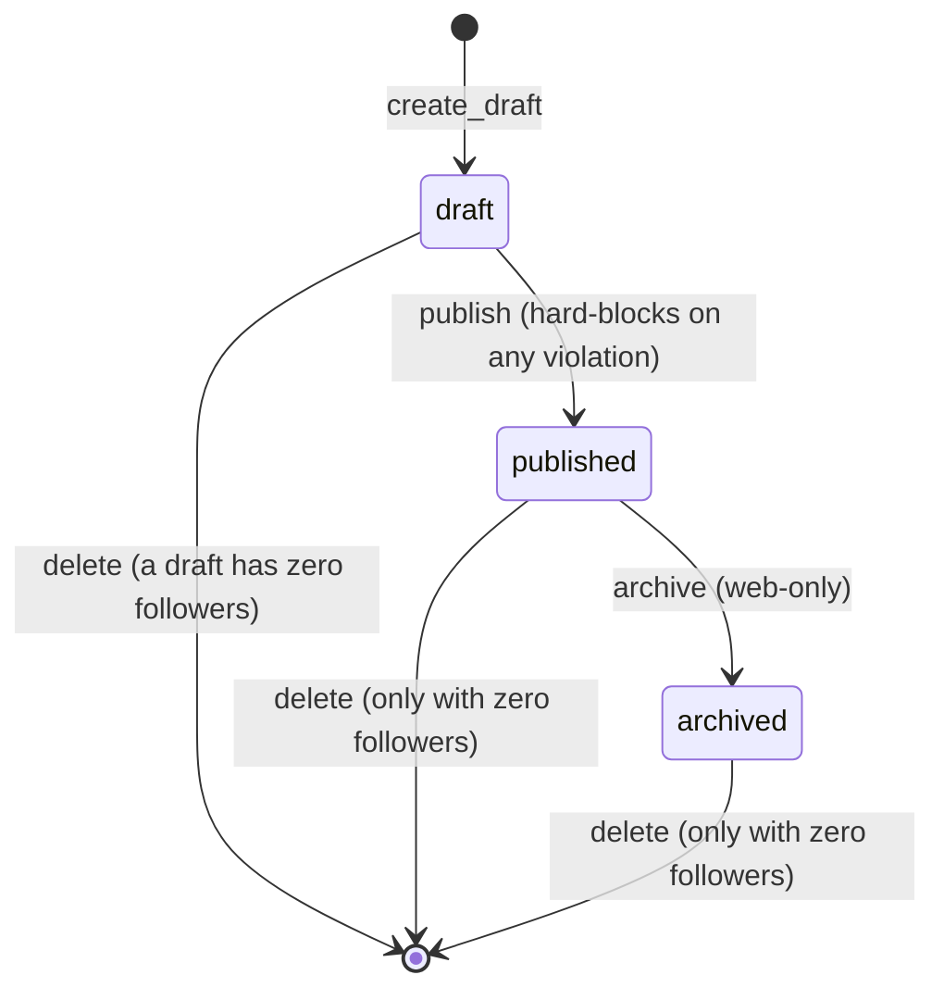

# Data model

This guide describes what wren stores, which component owns each store, and how the schema evolves. It documents the current implemented state and cites canonical source paths instead of reproducing DDL.

Canonical sources:

- ORM base and naming convention: `backend/src/wren/core/`
- Domain models: `backend/src/wren/roadmaps/`, `backend/src/wren/progress/`,
  `backend/src/wren/accounts/`, `backend/src/wren/oauth/`
- Migrations: `backend/alembic/`
- Migration operations runbook: `runbooks/migration.md`

All persistent state lives in one PostgreSQL database, reached by the backend over one async connection pool (`backend/src/wren/core/`). The MCP server holds no store of its own.

## Storage ownership

| Domain | Tables | Data owned |
|--------|--------|------------|
| roadmaps | `roadmaps` | The roadmap definition: the authoritative document plus a write-derived index |
| progress | `progress` | One record per user per roadmap: the checked-item set and an optional deadline |
| accounts | `users`, `revoked_sessions` | Human accounts and the session-revocation blacklist |
| oauth | `oauth_clients`, `oauth_auth_requests`, `oauth_authorization_codes`, `oauth_refresh_tokens`, `oauth_grants`, `oauth_audit_log` | The OAuth 2.1 AS persistence |

## Roadmaps

Table `roadmaps`, one row per roadmap (`roadmaps/`).

- The `document` JSONB column is authoritative. It holds the full nested roadmap (sections, subsections, checklist items, resources, the prerequisite DAG, and `suggested_path`).
- The scalar columns (`owner`, `title`, `status`, `visibility`, `revision`) are a write-derived denormalized index for owner-scoping and listing queries. They are never a second source of truth.
- The repository is the only writer. It re-derives every scalar column from the domain object on each write, so the columns cannot drift from the document.
- The persisted shape is the EASE model: ID-keyed maps plus explicit `*_order` arrays. Operations are order-invariant and no contract addresses a node by array index.
- The primary key `id` is the globally-unique `{title-slug}-{short-random}` slug. `owner` is a `users.id`, stored as a string with no hard foreign key.
- An index `ix_roadmaps_owner` backs the owner-scoped reads (migration `0003`).

## Progress

Table `progress`, one row per `(user_id, roadmap_id)` (`progress/`).

- The composite primary key `(user_id, roadmap_id)` enforces the one-record-per pair rule at the database. Every progress write upserts the same row.
- `checked` (JSONB) is the explicit-set map. Only checked items are retained; an unchecked item is simply absent.
- `deadline` (nullable date) is the optional per-user deadline.
- The row is created by the first progress write. See `progress.md` for the implicit-follow behavior.
- The derived read projections (the snapshot and the server-computed next) are never stored. They are recomputed on each read, so counts cannot drift.
- An index `ix_progress_roadmap_id` backs the global `count_followers` query behind the delete-only-if-zero-followers guard (migration `0005`).
- `user_id` and `roadmap_id` are strings with no hard foreign key.

## Accounts

Two tables (`accounts/`).

- `users`: `id` (a server-minted uuid hex), a unique `username`, a unique normalized `email`, the bcrypt `password_hash`, and `has_completed_onboarding`. The password is stored only as a hash.
- `revoked_sessions`: the `jti` blacklist. Each row revokes one session id (the `sid` shared by an access and refresh pair); presence means revoked. `expires_at` lets a later cleanup drop rows once the refresh token would have expired anyway.

See `auth.md` for the session model that uses this blacklist.

## OAuth

Six tables back the OAuth 2.1 AS (`oauth/`).

| Table | Purpose | Key notes |
|-------|---------|-----------|
| `oauth_clients` | Dynamic Client Registration records | Public clients (PKCE, no secret); `redirect_uris`, `grant_types`, `response_types` as JSONB |
| `oauth_auth_requests` | Parked `/authorize` requests | Addressed by opaque id, short-lived; holds the PKCE challenge, scope, state, resource |
| `oauth_authorization_codes` | One-time codes minted at consent | PKCE-bound; consumed before token mint |
| `oauth_refresh_tokens` | Rotating refresh tokens | Stored as `token_hash` (PK); `revoked` gates reuse; `grant_id` indexed for chain revoke |
| `oauth_grants` | The connected-client relationship | Unique `(user_id, client_id)`; `revoked_at` nullable |
| `oauth_audit_log` | Append-only authorization audit | Events: granted, token_issued, refreshed, revoked |

See `auth.md` for the token lifecycle and the stale-client reaper.

## Roadmap lifecycle

A roadmap's `status` follows a linear, one-way path. Fork always creates a new
roadmap with a new id, so it is a create, not a transition of the source.

| From | To | Trigger | Side effects |
|------|----|---------|--------------|
| (none) | draft | `create_draft` | New private draft at `revision` 1 |
| draft | published | `publish` | Content becomes immutable; any violation raises 422 and stays draft |
| published | archived | `archive` | Hidden from discovery; existing followers keep access; gains no new followers |
| any readable | new draft | `fork` | New roadmap id, private draft, no progress carry-over; source unchanged |
| draft, published, archived | (deleted) | `delete` | Refused with 409 `DELETE_HAS_FOLLOWERS` when followers exist |

Published and archived content is immutable. Only the presentation-only metadata edit is allowed after publish. See `authoring.md` for the write paths and the immutability boundary.

## Migration strategy

Migrations use Alembic (`backend/alembic`). The revision chain is linear:
`0001_baseline`, `0002_accounts`, `0003_roadmaps`, `0004_oauth`, `0005_progress`,
`0006_onboarding`.

- Every domain's ORM models inherit from one `Base` (`core/`), so `Base.metadata` is the single schema Alembic diffs for `--autogenerate`.
- The ORM sets a constraint naming convention, so constraint names are deterministic and stable. Autogenerated diffs stay reversible and read the same across environments. Keep the convention; changing it destabilizes diffs.
- Migrations run pre-traffic, never at app startup. Keep every normal migration additive (expand or contract) so an image-only rollback stays safe. The `0006` migration is the pattern: it adds a column with a safe server default, then backfills existing rows.
- Run migrations with `just migrate`. See `runbooks/migration.md` for operations.

## Cross-component references

- No hard foreign keys cross domain boundaries. `roadmaps.owner`, `progress.user_id`, and `progress.roadmap_id` are plain string keys.
- String keys keep the domains independently migratable.
- The service layer enforces cross-domain integrity, not the database. For example, the follower count behind the delete guard is a service-layer query, not a foreign-key cascade.
