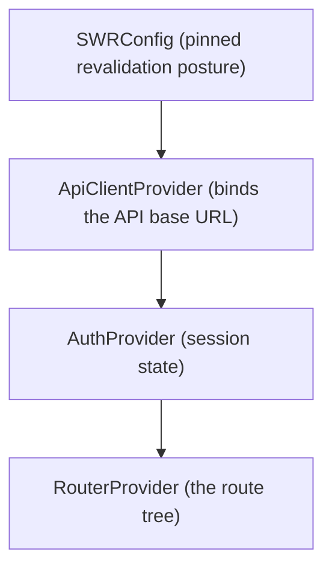
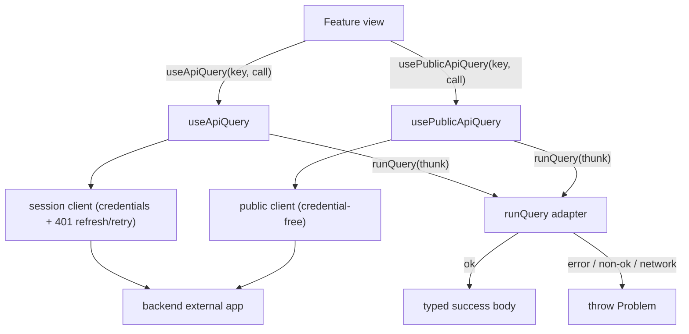

# Frontend

The wren frontend is a React 19 single-page app built with Vite. It serves human users. It talks to the backend external app over a typed REST client. This guide describes the app-level plumbing, the routing and guards, the session and data layers, the views, the component library, and the study loop as it works on the web.

This guide documents the current implemented state and cites canonical source paths. See `design-language.md` for look-and-feel rules, `api.md` for the REST surface and the error contract, `auth.md` for the session and OAuth model, `progress.md` for the study loop, `authoring.md` for the content model, and `architecture.md` for the system shape.

Canonical sources:

- Provider composition and entry: `frontend/src/App.tsx`, `frontend/src/main.tsx`
- Route tree and guards: `frontend/src/routes.tsx`,
  `frontend/src/components/OnboardingGate/`,
  `frontend/src/views/OnboardingView/`
- Session and auth: `frontend/src/auth/`
- Data layer: `frontend/src/api/`
- Views: `frontend/src/views/`
- Shared components and tokens: `frontend/src/components/`,
  `frontend/src/globals.css`, `shared/theme/`
- Dev mocks and test harness: `frontend/src/mocks/`, `frontend/src/test/`

## Overview

The web app is a reader, tracker, publisher, forker, and lifecycle manager.

The web app does not author roadmap content. Content authoring (create, patch, replace, validate) has no web UI. An AI agent authors through the MCP server. The only sanctioned web edit is presentation-only metadata (title, description, subject tags). See `authoring.md`.

## Provider stack

`App.tsx` composes providers only. It holds no routing config. The nesting order is fixed, because each layer depends on the one above it.

`App.tsx` reads `VITE_API_BASE_URL` once at the root. The deployment base never changes at runtime, so no leaf reads `import.meta.env`. The default is `''` (same-origin), which the dev proxy and the mock worker both rely on.

`ApiClientProvider` builds exactly one session client and one public client per base URL, memoized on the base URL. It shares both through context. Every hook drives the same session client, so one refresh coalesces concurrent 401s.

## Routing and guards

`routes.tsx` holds the route tree. It is kept separate from `App.tsx` so a routing test can assert structural invariants without rendering views.

| Path | View | Gating |
|------|------|--------|
| `/onboarding` | `OnboardingView` | Wrapped in `OnboardingRouteGuard`; mounted outside `AppShell` (full screen, no top bar) |
| `/` | `LandingView` | Public, inside `AppShell` |
| `/auth` | `AuthView` | Public |
| `/authorize` | `ConsentView` | Ungated by structural placement (sibling of the gate, not inside it) |
| `/dashboard` | `DashboardView` | Inside `OnboardingGate` |
| `/user/:handle` | `ProfileView` | Inside `OnboardingGate` |
| `/settings/connections` | `ConnectedClientsView` | Inside `OnboardingGate` |
| `/roadmaps/:roadmapId/tree` | `TreeView` | Inside `OnboardingGate` |
| `/roadmaps/:roadmapId` | `RoadmapView` | Inside `OnboardingGate` |
| `*` | `NotFoundView` | Inside `OnboardingGate` |

Two guards cover two concerns:

- `OnboardingGate` keeps a signed-in, un-onboarded user inside onboarding for the in-app routes.
- `OnboardingRouteGuard` keeps onboarded and anonymous users off the `/onboarding` route.

Both guards fail open when the onboarding flag is missing. This is version-skew safety, not a bug. Preserve it.

`/authorize` sits outside `OnboardingGate` by placement, not by a conditional. This keeps a user who is mid agent-authorization from being bounced into onboarding. Keep `/authorize` a direct child of `AppShell`.

## Session and auth

The session client sets `credentials: 'include'` and installs a response middleware for token refresh. See `auth.md` for the backend session model.

The refresh flow:

1. A request returns 401 on a non-auth path.
2. The client calls `POST /auth/refresh` once. A shared in-flight promise coalesces concurrent 401s onto one refresh.
3. On success, the client retries the original request.

The refresh-and-retry replays the original request by re-issuing it. This is safe only for bodyless requests, which product reads are. A body-consuming write cannot rely on transparent retry.

The middleware skips the `/auth/` prefix to avoid recursion. Do not route other endpoints under `/auth/` unless you want them exempt from refresh.

Session state is one `{ status, user }` union, so "authenticated with no user" cannot arise. `useAuthSession` resumes the session once on mount through `POST /auth/refresh`. The session cookie is scoped to `.usewren.com`, so the SPA and API subdomains share it.

## Data layer

The `api/` layer is the single seam between `openapi-fetch` and SWR.

| Module | Role |
|--------|------|
| `keys/keys.ts` | The single source of SWR cache identity. Each builder returns a path literal plus a params tuple. |
| `fetcher/fetcher.ts` | `runQuery`: turns one `openapi-fetch` result into SWR's throw-based model. Returns the typed body on success; throws a `Problem` otherwise. |
| `useApiQuery/useApiQuery.ts` | A read bound to the session client. A `null` key disables the read. |
| `usePublicApiQuery/usePublicApiQuery.ts` | A read bound to the credential-free public client. Today only the profile read uses it. |
| `swr-config/swr-config.ts` | The pinned revalidation posture: fetch once on mount, no background revalidation, a 2s dedup window. |

Reads register their key in `keys.ts`. A write reuses the same builder so the `mutate()` call targets the same cache entry. A write that returns the updated resource reconciles the cache in place with `mutate(returned, { revalidate: false })`, so co-mounted views stay coherent with no refetch and no stale flash.

The `Problem` type (`frontend/src/lib/problem/`) mirrors the backend RFC 9457 error body. It is the error contract every hook surfaces. The frontend branches on the codes `STALE_REVISION`, `IMMUTABLE`, `DELETE_HAS_FOLLOWERS`, and `VALIDATION`. See `api.md` for the canonical error contract; the frontend never restates it.

## Views

Each view is one route target. A view is a thin orchestrator: it reads route params and auth, calls one data hook, and routes the phase states (loading, error, empty, loaded). Data hooks live under each view's `hooks/`. Pure helpers live under `util/` with co-located tests.

| View | Data hook(s) | Endpoints |
|------|--------------|-----------|
| `LandingView` | `useStartDestination` | none (auth-aware CTA only) |
| `AuthView` | `useAuth` | `POST /auth/login`, `POST /auth/register` |
| `OnboardingView` | `useOnboarding` | `POST /me/onboarding:complete` |
| `DashboardView` | `useDashboard` | `GET /me/dashboard` |
| `ProfileView` | `useProfile` | `GET /users/{handle}` (public read) |
| `ConnectedClientsView` | `useConnectedClients` | `GET /me/clients`, `DELETE /me/clients/{id}` |
| `ConsentView` | `useConsent` | `GET /authorize/context`, `POST /authorize/decision` |
| `RoadmapView` | `useRoadmap`, `useProgress`, `useLifecycle` | roadmap read, publish, fork, metadata, progress, deadline, visibility, archive, delete |
| `TreeView` | `useTreeData` | roadmap read, progress read |
| `NotFoundView` | none | none |

`RoadmapView` branches on `roadmap.status`. A draft renders a read-only preview plus a publish panel; a draft is not startable. A published or archived roadmap renders the interactive list with progress. `TreeView` reads the same roadmap and progress keys as `RoadmapView`, so the two views de-duplicate onto one request per key.

Two hard boundaries govern the roadmap UI:

- Draft versus published: checkboxes and progress appear only after publish.
- Owner versus reader: any reader can fork; only the owner can edit metadata and run lifecycle.

Lifecycle (visibility, archive, delete) is web-only. Delete is guarded server-side by a zero-followers check; a 409 `DELETE_HAS_FOLLOWERS` steers the owner to archive instead. See `authoring.md` for the publish and immutability contract.

## Study loop on the web

The web drives the shared study loop (`progress.md`) through `useProgress`. Following is implicit and there is no follow or unfollow affordance, so do not build a follow button; the Dashboard "Following" list comes from `GET /me/dashboard`.

Web-specific behavior:

- Progress writes are optimistic. `useProgress.toggle` sets the target state, updates the cache first through `optimisticData`, then reconciles the returned snapshot. A 409 surfaces the re-read prompt; any other failure rolls back and shows a quiet notice.
- Done-state is derived from the checked-item set, never stored. The list and the tree share one `isSubsectionDone` rule, so both surfaces always agree.
- `useProgress.setDeadline` calls `PUT /deadline`; the deadline drives a countdown only. It is web-only and unmirrored in the MCP contract (see `progress.md`).

The study-time reads (overview, node, section, search) are the agent's token-efficient projections. The web app uses the full roadmap read plus progress. See `progress.md` for the read surface and the `concise` versus `detailed` switch.

## Component library and design tokens

The shared component library splits into a small vendored subset and Wren components built on top of it.

- Vendored shadcn/ui primitives under `frontend/src/components/ui/`: only `button`, `input`, and `dropdown-menu`. This directory is excluded from coverage. Do not hand-edit it; wrap it instead.
- Wren components: `AppShell`, `badges`, `forms`, `RoadmapCard`, `RoadmapCardGrid`, `RoadmapViewTabs`, and the `states` family.

The `states` family holds the shared status surfaces. `WarningBanner` is the shared base for the write-contract notices. Compose the specific notices (`StaleRevisionNotice`, `ImmutableNotice`, `ViolationList`), not `WarningBanner` directly. Every status surface pairs a hue with an icon or text, so meaning never rides on color alone.

The design tokens live in `shared/theme/tokens.css` (color, radius, tag palette, font stacks) and `shared/theme/fonts.css` (self-hosted variable fonts). Both are framework-neutral and shared with the docs site. `globals.css` bridges the tokens onto Tailwind v4 and defines the base style and the display utilities.

`main.tsx` imports CSS in a fixed order: `fonts.css`, then `tokens.css`, then `globals.css`. `globals.css` reads token variables, so it must come last. Add new token values to `shared/theme/tokens.css` only; `globals.css` maps them, never defines them.

Tag color is a domain truth. The tag-color module (`frontend/src/lib/tag-color/`) hashes a tag string into a fixed ten-hue palette, mirrored as `--tag-1..10` in `tokens.css`. The palette order and the hash are a frozen cross-view contract. Do not reorder them; reordering repaints existing roadmaps. See `design-language.md`.

## Dev mocks and testing

`frontend/src/mocks/` holds a Mock Service Worker harness that serves the app with zero backend. `main.tsx` starts the worker only when `VITE_MOCK_API=true` (`just dev-mock`). Handler paths are `*`-prefixed, so they match any API base. Fixtures alias the generated schema types, so the harness stays pinned to the real contract.

`frontend/src/test/` holds the shared render harnesses. `renderWithProviders` mounts the full provider stack for hooks and integration tests, with a fresh SWR cache per mount. `renderWithAuth` mounts only auth plus a router for chrome components. vitest enforces a 70% line coverage floor. See `testing.md`.

## Environment variables

The frontend reads three build-time variables. See `frontend/src/vite-env.d.ts` for the types and `.env.example` for the annotated list.

| Variable | Read at | Purpose | Default |
|----------|---------|---------|---------|
| `VITE_API_BASE_URL` | `App.tsx` root | The backend external app base URL | `''` (same-origin) |
| `VITE_MCP_BASE_URL` | `OnboardingView` root | The MCP server URL shown on the connect-agent step | `https://mcp.usewren.com` |
| `VITE_MOCK_API` | `main.tsx` | `true` starts the MSW mock worker | unset |
