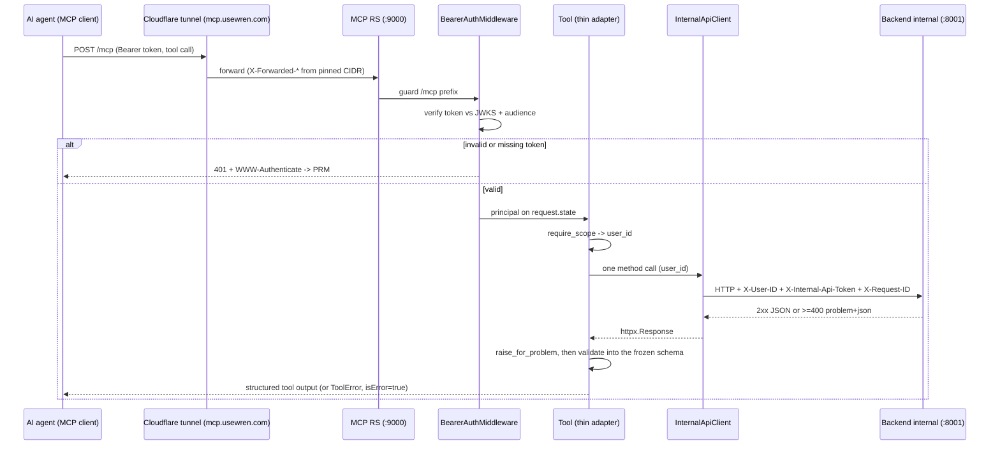

# MCP server

The MCP server is wren's AI-agent front door. It exposes roadmap authoring and
study tools over the Model Context Protocol (MCP) so an agent can create,
publish, and study roadmaps. It is a separate deployable image (`wren-mcp`) and
an OAuth 2.1 Resource Server (RS).

The server is a thin dispatcher. It holds no roadmap logic and imports no backend
code. Each tool body is one authenticated call to the backend internal app
(`:8001`), so the rules live in one place (the shared `RoadmapService`). The
package re-declares the wire truths it shares with the backend (header names,
scopes, schema shapes) and keeps them in sync by contract tests, not by import.
See `infra-duplication.md` for the duplication model and its drift gate.

Canonical sources: `mcp/src/wren_mcp/`. This doc cites the module for each claim.

## Transport

Canonical source: `mcp_server.py` (server factory), `app.py` (RS assembly),
`main.py` (entrypoint).

- Framework: `FastMCP` from `mcp.server.fastmcp`. The framework owns tool
  execution, schema generation, and the Streamable HTTP protocol.
- Transport: Streamable HTTP, stateless, JSON responses (`stateless_http=True`,
  `json_response=True`). Each tool call is one authenticated `POST`. No per-agent
  session is pinned. This is the recommended production mode.
- Process: `main.py` builds the app with `build_app` and runs uvicorn on `:9000`.
  The tunnel reaches it at `mcp.usewren.com`.

### The two explicit transport routes

`app.py` binds two explicit full-match routes, `POST /mcp` and `POST /mcp/`, to
the bare ASGI transport (`StreamableHTTPASGIApp`). It does not use a `Mount`.

Warning: a `Mount` only partial-matches `/mcp`, so Starlette's `redirect_slashes`
emits a 307 from `/mcp` to `/mcp/`. That 307 stalls https-to-http MCP clients for
about 30 seconds. Keep the two explicit routes.

`app.py` calls `mcp.streamable_http_app()` once during assembly. That call has a
side effect: it creates the session manager. The `session_manager` property
raises without it. The returned sub-app is intentionally not mounted.

### DNS-rebinding protection

`_transport_security` in `mcp_server.py` sets the policy:

- Development: protection is disabled, so the local MCP Inspector can attach over
  localhost.
- Production: protection is enabled and scoped to the pinned resource host. This
  is defense in depth behind the tunnel and the bearer boundary.

## Middleware order

`create_rs_app` adds middleware so the effective outermost layer runs first. The
verified order, outermost first:

| Order | Middleware | Scope | Purpose |
|-------|------------|-------|---------|
| 1 (outermost) | `ProxyHeadersMiddleware` | Production only | Trust `X-Forwarded-*` from the pinned app-net CIDR. Rewrite the tunnel's plaintext scheme to https. |
| 2 | `CORSMiddleware` | Development only | Serve the browser MCP Inspector's OAuth discovery and token-exchange fetches. |
| 3 | `CorrelationMiddleware` | Always on | Bind a fresh `request_id`. Correlate the non-guarded paths too. |
| 4 | HTTP metrics (`instrument`) | Always on | Count requests, including the boundary's 401s. |
| 5 (innermost) | `BearerAuthMiddleware` | Guards the `/mcp` prefix | The agent trust boundary. |

The dev-only and prod-only layers are mutually exclusive by environment. CORS is
mounted only when `allowed_cors_origins` is non-empty (development). Proxy headers
are mounted only when `trusted_proxies` is non-empty (production).

## The bearer boundary

Canonical source: `auth.py`, with `scopes.py`, `tokens.py`, `state.py`.

`BearerAuthMiddleware` is the RS security perimeter. It guards the `/mcp` path
prefix at the boundary, not per route, so a tool route under the prefix cannot
forget to authenticate.

- Every request under `/mcp` must carry `Authorization: Bearer <token>`.
- The verifier checks the token against the AS public JWKS and binds it to this
  RS's audience.
- A missing or invalid token returns `401` with a `WWW-Authenticate` header that
  points at the PRM document, so the client can discover the AS.
- On success the middleware stashes the resolved principal on `request.state`,
  never the raw token, and binds `user_id` into the correlation context.

`require_scope` (in `scopes.py`) is the only way a tool obtains its `user_id`. It
fuses identity resolution with the scope check, so a tool cannot skip
authorization. A missing scope raises a model-recoverable `ToolError`
(`insufficient_scope`) that names the missing scope. A tool reached without the
guard fails closed (`unauthenticated`).

The RS verifies tokens but mints none. The backend external app (`:8000`) is the
OAuth 2.1 Authorization Server (AS). See `auth.md` for the full token model:
audience binding, `kid` rotation, and the discovery chain.

## Scopes

Defined in `config.py`, advertised in the PRM (`prm.py`). Scope semantics follow
OAuth 2.1: `scope` is a space-delimited set.

| Scope | Tools that require it |
|-------|-----------------------|
| `roadmaps:read` | The six read tools, including `progress_get` |
| `progress:write` | `progress_update` |
| `roadmaps:write` | The seven write tools |

`SUPPORTED_SCOPES` mirrors the backend AS supported scopes, so a client sees a
consistent set on both discovery documents.

## Tool catalog

The server registers 14 tools. Each tool is a thin adapter: it enforces the
required scope, resolves the single `user_id`, makes one internal call (except
`replace_roadmap_draft`, which reads the current revision first), and validates
the response into a frozen projection. Every tool registers through
`counted_tool_registrar` and opens with `require_scope`.

### Read tools

Canonical source: `tools_read.py`. Six reads require `roadmaps:read` and are
`readOnlyHint`: `roadmap_get_overview`, `roadmap_get_next`, `roadmap_get_node`,
`roadmap_get_section`, `roadmap_search`, and `progress_get`. `progress_update`
requires `progress:write` and is an explicit-set write (`idempotentHint`,
`destructiveHint` false); an unknown item id rejects the whole batch. All are
`openWorldHint` false. Each maps to one internal `GET` (`POST` for
`progress_update`); see `api.md` for the endpoints and `progress.md` for the
study-loop semantics (`why_now`, server-computed next, the deadline).

The `concise` and `detailed` switch travels as `?format=`. Concise is the default
and carries every follow-up ID. Detailed adds the free-text (a node `description`,
each next item's `path_position`).

### Write tools

Canonical source: `tools_write.py`. Seven tools require `roadmaps:write` and are
`openWorldHint` false: `create_roadmap_draft`, `patch_roadmap_draft`,
`replace_roadmap_draft`, `validate_roadmap_draft`, `publish_roadmap`,
`fork_roadmap`, and `edit_roadmap_metadata`. There is no visibility, archive, or
delete tool: those are web-only. See `authoring.md` for the write-path rules and
the immutability boundary, and `api.md` for the endpoints.

Three MCP-specific behaviors: `replace_roadmap_draft` reads the current revision
first, so it is the one tool that makes two internal calls; `publish_roadmap`'s
docstring tells the agent to confirm with the user first; and
`edit_roadmap_metadata` is presentation-only and stays allowed after publish.

## Patch operation grammar

Canonical source: `schemas.py`. `patch_roadmap_draft` accepts an ordered
`operations[]` array, discriminated on `op`. Every op is key-addressed by slug
ID. Ordering uses `before_id` or `after_id`, never array position. The 16 op
types:

`add_subsection`, `update_subsection`, `remove_subsection`, `add_edge`,
`remove_edge`, `set_tags`, `set_resources`, `set_effort`, `add_item`,
`update_item`, `remove_item`, `reorder`, `set_suggested_path`, `add_section`,
`update_section`, `remove_section`.

Every `add_*` op accepts an optional `proposed_id`. The server mints one
otherwise and echoes a `proposed_id -> minted_id` remap on de-dup. The whole batch
is validated together, including that no intermediate step forms a prerequisite
cycle. Order `add_edge` ops prerequisites-first to avoid a transient cycle even
when the final graph is acyclic.

The MCP schemas mirror the backend authoring and read projections. A schema-mirror
contract test (`contract/tests/`) enforces field equality.
See `authoring.md` for the shared authoring rules and the immutability boundary.

## The internal-hop boundary contract

Canonical source: `client.py`, `config.py`, `tool_errors.py`. This is the second
hop: the RS to the backend internal app.

### Boundary headers

The RS sends these headers to the backend internal app. Canonical source:
`config.py` (`USER_ID_HEADER`, `INTERNAL_TOKEN_HEADER`) and `client.py`
(`REQUEST_ID_HEADER`).

| Header | Purpose |
|--------|---------|
| `X-User-ID` | The resolved user identity. The internal app trusts it only behind a valid token. |
| `X-Internal-Api-Token` | The shared secret. The primary boundary on `:8001`, which is not tunnel-routed. |
| `X-Request-ID` | The correlation id. The backend honors it instead of minting a new one. |
| `If-Match` | The target revision for optimistic concurrency on `PATCH` and `PUT`. |

Invariants of the hop:

- The agent bearer token is never forwarded. Only the resolved `user_id` crosses
  the boundary. This is the confused-deputy defense.
- `client._request` copies `extra_headers` first, then sets the trusted pair
  (`X-User-ID`, `X-Internal-Api-Token`) last, so a caller cannot override the
  trusted identity.
- The RS is the origin of an agent action. It always mints a fresh `request_id`
  and never honors an inbound `X-Request-ID` from the agent surface.
- The internal client timeout is bounded at 10 seconds, so a hung backend call
  cannot pin an MCP worker.

### Client method to endpoint map

`InternalApiClient` exposes one method per tool, and the method names mirror the
internal router ops 1:1. Canonical source: `client.py`; the endpoints are
cataloged in `api.md`. Preserve the 1:1 shape when you add a tool.

### Error translation

Canonical source: `tool_errors.py`. The error contract itself has one canonical
home: `api.md`. This doc does not restate it.

- A backend response of `>=400` carries an RFC 9457 `application/problem+json`
  body. `raise_for_problem` folds it into one model-recoverable
  `BackendToolError` that the agent can self-correct against. The error also
  carries the HTTP status and problem code for structured logging.
- A transport failure (backend unreachable or timed out) becomes a
  model-recoverable `ToolError` (`backend_unavailable: ... retry shortly`).
- A `>=400` response is not a transport failure. It passes through untouched so
  `raise_for_problem` can map it.

## RS-served endpoints

Canonical source: `app.py`, `health.py`, `metrics.py`, `prm.py`.

| Endpoint | Purpose | Exposure |
|----------|---------|----------|
| `POST /mcp` and `POST /mcp/` | The MCP transport, behind the bearer guard | Public at the tunnel ingress |
| `GET /.well-known/oauth-protected-resource` | The PRM document (RFC 9728), built from pinned config | Public at the tunnel ingress |
| `GET /.well-known/oauth-protected-resource/mcp` | The same PRM document, path-suffixed for discovery | Public at the tunnel ingress |
| `GET /healthz` | Liveness. Always 200 | In-network on `:9000` only |
| `GET /readyz` | Readiness. 503 if any check fails. Runs `jwks_readiness_check` | In-network on `:9000` only |
| `GET /metrics` | Prometheus. The private HTTP registry plus `TOOL_METRICS_REGISTRY` | In-network on `:9000` only |

Warning: the tunnel ingress (`mcp.usewren.com`) exposes only the PRM document and
the `/mcp` transport. It returns 404 for everything else. Scrape `/metrics` and
poll health in-network on `:9000`.

## Metrics

Canonical source: `tool_metrics.py`, `metrics.py`; full detail in `monitoring.md`.
The RS emits `mcp_tool_invocations_total{tool,outcome}` on a dedicated
`TOOL_METRICS_REGISTRY`, plus the shared `http_requests_total` /
`http_request_duration_seconds` families on its private registry. `/metrics`
serves both registries concatenated.

## Cross-surface notes

These record intentional design, verified against the current source. Read them
before you assume a tool exists.

- The authoring guidance (`SKILL.md`) lives on the backend, not the MCP server.
  The backend external app serves it at `GET /skill` on its API origin (the AS
  host). Route registry: `/skill` is `PUBLIC` on the external app only
  (`backend/src/wren/core/`). The MCP tool docstrings point the
  agent there. The MCP server serves only the PRM document and `/mcp` at ingress.
- The deadline is web-only: there is no MCP deadline tool. `progress_get` reads
  the deadline; `progress_update` writes progress. The `DeadlineRequest` and
  `Progress` types are deliberately unmirrored in the MCP contract
  (`contract/tests/`). See `progress.md`.
- Following is created implicitly by the first progress write. There is no follow
  or unfollow MCP tool; the internal `POST /roadmaps/{id}/follow` route is
  vestigial and unused by any client method. See `progress.md`.

## Related docs

- Token model, audience binding, and discovery: `auth.md`.
- REST route catalog and the error contract: `api.md`.
- Cross-package duplication and its drift gate: `infra-duplication.md`.
- Metrics, alerts, and retention: `monitoring.md`.
- Shared authoring rules and the immutability boundary: `authoring.md`.
- Follow and study-loop semantics: `progress.md`.
- The system topology and trust zones: `architecture.md`.
