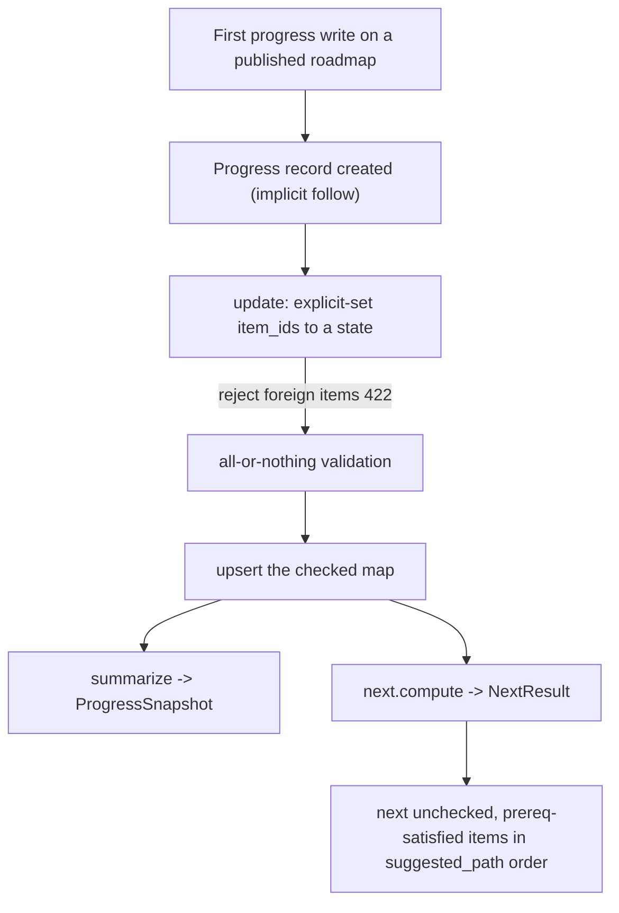

# Progress and the study loop

Progress is wren's second top-level entity. A learner follows a published roadmap,
tracks completion against its structure, and asks the server what to do next. This
guide describes the study loop, the follow model, the study-time reads, and the
progress-to-roadmaps coupling.

This guide documents the current implemented state and cites canonical source
paths. See `authoring.md` for how roadmap content is created, `api.md` for the
progress endpoints, and `architecture.md` for the system shape.

Canonical sources:

- Progress rules, server-computed next, and derived snapshot: `backend/src/wren/progress/`
- Study-time reads: `backend/src/wren/roadmaps/`

## The study loop

## Follow model

- A progress record is created implicitly by the first progress write. Checking an
  item (`progress_update`) or setting a deadline on a published roadmap creates the
  record. This holds on both surfaces: the web app and MCP.
- There is no explicit follow or unfollow affordance on any surface. Unfollow does
  not exist.
- `POST /roadmaps/{id}/follow` is a vestigial internal endpoint. Neither the web
  app nor MCP calls it; only tests and the e2e suite do. Do not document or build a
  follow button.
- Starting to follow requires a published roadmap the caller may read (their own,
  or a public one). A draft is not startable.
- An archived roadmap is closed to new participation. It keeps existing followers
  and their progress but gains no new ones. A caller with no existing record cannot
  start tracking an archived roadmap, so the upsert never creates a phantom
  follower. This keeps `count_followers` stable for the owner's delete guard.
- An unreadable roadmap is a 404 with no existence leak.

## Explicit-set progress

Progress updates are explicit-set, not toggle. The client states the target state,
so a retry is idempotent (`progress/`).

- `POST /roadmaps/{id}/progress` sets `item_ids` to a `CompletionState`
  (`complete` or `incomplete`). At least one id is required.
- Validation is all-or-nothing. A foreign or nonexistent item id is a 422 and
  applies nothing.
- The `checked` map keeps only checked items. Setting an item to `incomplete` drops
  its key.
- The response is the fresh snapshot (in detailed mode) plus the next suggestion.

## Derived snapshot

The snapshot is a derived read. Nothing here is stored; it is recomputed from the
roadmap and the caller's record on each read, so counts cannot drift
(`progress/`).

- `GET /roadmaps/{id}/progress` returns roadmap-wide and per-section completion
  counts.
- `detailed=true` adds the exact `checked_ids` set. The default stays concise.

## Server-computed next

The "what to do next" computation runs on the server, never on the agent
(`progress/`).

- `GET /roadmaps/{id}/next` walks `suggested_path` and returns the unchecked items
  of the first subsection that is not done and whose prerequisites are all done.
- Each item carries a structural `why_now` and its resource links.
  `remaining_in_path` counts the subsections still to do. `complete` is true when
  every item is checked.
- The `why_now` rationale is structural only. It states mechanical facts (this is
  the next unchecked subsection in `suggested_path` and its named prerequisites are
  complete). It never contains pedagogical reasoning. That intelligence lives in
  the agent and was baked into `suggested_path` at authoring time. This guards the
  load-bearing thesis that the app is not the brain.
- `format=detailed` adds each item's `path_position`.

## Deadline

- `PUT /roadmaps/{id}/deadline` sets a date or clears it with `null`. It is
  editable and clearable at any time, and a past date is allowed.
- The deadline drives a countdown only. The server computes no pacing or effort
  forecast.
- The deadline is web-only by design. `DeadlineRequest` and `Progress` are
  deliberately unmirrored in the MCP contract, guarded by
  `contract/tests/`, so there is no MCP deadline tool.

## Study-time read surface

The study-time reads live in `RoadmapReadService`, a separate service from
authoring (`roadmaps/`). They are the read surface a follower uses
while studying. The counts reflect the caller's own progress.

| Read | Endpoint | Purpose |
|------|----------|---------|
| Overview | `GET /roadmaps/{id}/overview` | Orientation: per-section and overall counts, no item bodies |
| Node | `GET /roadmaps/{id}/nodes/{sid}` | One subsection: resolved prereqs, resource links, items with done-state |
| Section | `GET /roadmaps/{id}/sections/{sid}` | Paginated drill-down; opaque cursor |
| Search | `GET /roadmaps/{id}/search` | Search subsections and items by keyword or tag |

These reads accept the shared `concise | detailed` switch. Concise omits the
verbose node `description` while still carrying every follow-up id. Detailed adds
it. See `api.md` for the read format and section pagination.

## Progress-to-roadmaps coupling

`ProgressService` reads roadmaps straight from the roadmap repository. This
coupling is deliberate and labeled in the source, not an accidental dependency.

- The roadmaps domain never imports the progress repository into its own logic. It
  receives narrow injected callables instead (for example the follower counter and
  the checked-item reader).
- The reverse arrow (`ProgressService` composing the roadmap repository) is the one
  place the two domains couple directly.
- Do not "clean this up" by removing the coupling. A shared read-port abstraction
  is the planned follow-up; remove the coupling only as part of that change.
